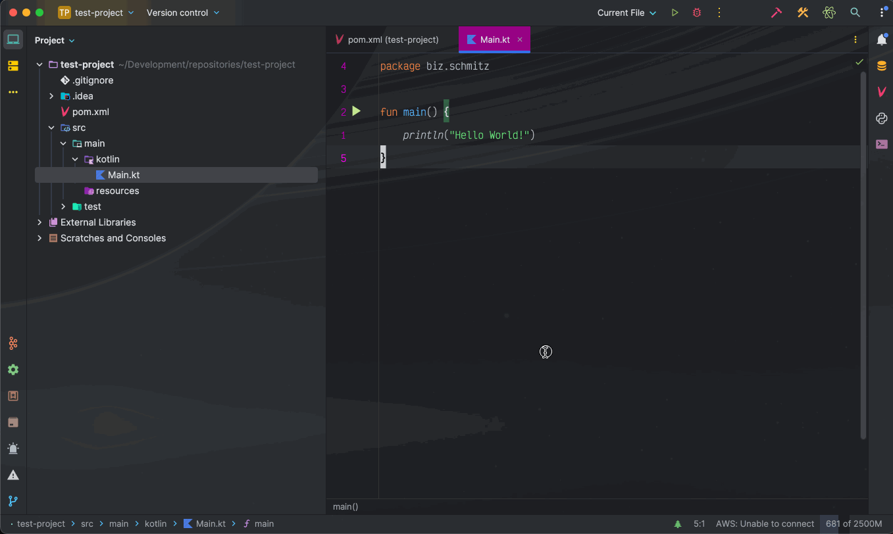
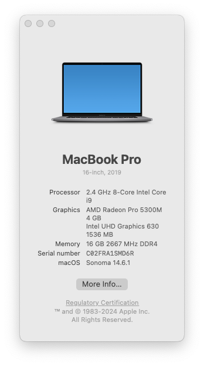

# Intellij Bug - Create Class option no longer available

This is a intellij generated kotlin project used to reproduce the bug I'm experiencing where the "Create Class" action
is not available when writing a constructor call for a class that does not yet exist.

## Version information

### Intellij

IntelliJ IDEA 2024.2.1 (Ultimate Edition)
Build #IU-242.21829.142, built on August 28, 2024
Licensed to Label Insight / Chris Schmitz
Subscription is active until October 5, 2024.
Runtime version: 21.0.3+13-b509.11 x86_64 (JCEF 122.1.9)
VM: OpenJDK 64-Bit Server VM by JetBrains s.r.o.
Toolkit: sun.lwawt.macosx.LWCToolkit
macOS 14.6.1
Kotlin plugin: K2 mode (Beta)
GC: G1 Young Generation, G1 Concurrent GC, G1 Old Generation
Memory: 3072M
Cores: 16
Metal Rendering is ON
Registry:
ide.balloon.shadow.size=0
debugger.valueTooltipAutoShowOnSelection=true
debugger.new.tool.window.layout=true
documentation.show.toolbar=true
editor.codeVision.more.inlay=true
ide.experimental.ui=true
ide.experimental.ui.inter.font=true
i18n.locale=
kotlin.code-vision.inheritors=true
editor.minimap.enabled=true
kotlin.code-vision.usages=true
Non-Bundled Plugins:
com.intellij.notebooks.core (242.21829.3)
com.github.bric3.excalidraw (0.4.0)
org.intellij.plugins.hcl (242.21829.3)
PythonCore (242.21829.142)
aws.toolkit.core (3.27-242)
com.jetbrains.space (242.21829.142)
IdeaVIM (2.16.0)
String Manipulation (9.14.1)
Pythonid (242.21829.142)
org.jetbrains.plugins.kotlin.jupyter (242.21829.142)
intellij.jupyter (242.21829.142)
org.jetbrains.plugins.github (242.21829.162)
net.seesharpsoft.intellij.plugins.csv (3.4.0-242)
com.intellij.bigdatatools.core (242.21829.142)
com.intellij.bigdatatools.binary.files (242.20224.159)
com.intellij.bigdatatools.rfs (242.21829.142)
com.intellij.bigdatatools.metastore.core (242.20224.159)
com.intellij.bigdatatools.flink (242.20224.159)
com.clutcher.comments_highlighter (2024.2.2.1)
com.mallowigi (97.0.0)
com.intellij.bigdatatools.kafka (242.20224.159)
aws.toolkit (3.27-242)
com.intellij.bigdatatools.spark (242.20224.159)
com.intellij.bigdatatools.zeppelin (242.20224.159)
Kotlin: 242.21829.142-IJ

### Operating system

